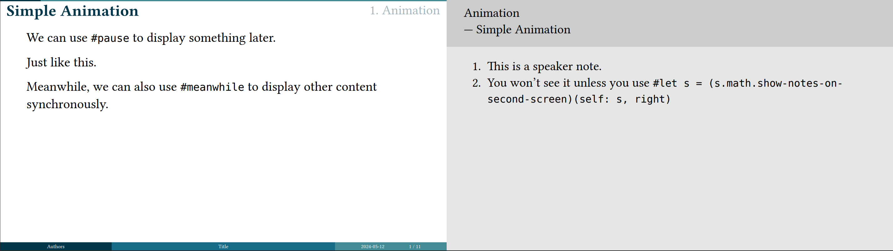

# pdfpc-ts

在浏览器上重新实现带演讲者视图的幻灯片放映，类似 Pympress 和 pdfpc，但性能更好。

## 用法

我假定演讲所用 PDF 长宽比为 16:9。如果有提示，约定每页左半部分是正稿，右半部分是提示。例如：

↑ 图源 [Touying 文档](https://touying-typ.github.io/zh/docs/external/pympress/)

我推荐使用 Typst + Touying 创建演讲所用 PDF。

界面用法应当一目了然。大体来讲，页面有三种状态：

* 首页，选择文件进入概览；
* 概览，刚进入时会依次渲染每页，点击页面从该页开始放映，点击下方按钮从头放映；
* 开始放映，主窗口变成本页、下一页和本页提示。会弹出窗口，建议手动拖到需要的地方并全屏显示。

放映过程中，也可以在概览和放映中模式间切换，以快速翻页。弹出窗口不受影响。

支持的键盘快捷键：

* ←→翻页，空格下一页
* Escape 结束放映

理论上支持从网络获取 PDF。PDF 应该用 Cross-Origin-Resource-Policy 标记允许被请求。目前只能加载相同域名下的示例，因为我懒得改 CSP。

## 限制

本项目够我自己用就行，我不想造第二个 PowerPoint。如果你喜欢 typst 的排版效果又不愿放弃 PowerPoint 的丰富功能，我建议把 PDF 的每一页打印到 PowerPoint 当背景用。

* 没有优化移动端 UI；
* PDF 格式选项不如 pdfpc 灵活；
* 没有笔和激光笔；
* 不支持选中文字、超链接等，因为我只渲染了位图；
* 不支持b键黑屏。
* 不支持视频。
* 仅支持非常新的浏览器。例如，我用了 `using` 关键字，对应支持 Chrome >= 134，Firefox >= 141，Safari 死了。祈祷下次演讲我能用自己的电脑……

## 已知问题

* wasm-vips 占用过多内存；

## 演示

TODO

## 创作动机

* 浏览器从一开始就支持[多窗口](https://developer.mozilla.org/en-US/docs/Web/API/Window/open)。
* [Chrome 100 支持了 Window Management API](https://developer.chrome.google.cn/docs/capabilities/web-apis/window-management?hl=zh-cn)，有助于在合理位置创建窗口。官方表示演讲者视图为潜在用途之一，但我并没有发现这样的轮子。
* 我是 pdfpc 用户，同时负责为 msys2 平台打包。pdfpc 性能不佳，翻页时总是卡顿。我也不喜欢 GTK 3，但我无力迁移。
* RIIR 是迁移的替代方案，在跨平台甚至 wasm 平台上有显著优势。当前原生 GUI 框架如 winit [封装了 `window.open()`](https://github.com/rust-windowing/winit/pull/3801)，但是 Rust GUI 目前普遍不够成熟，我跑起来 Hello World 的，只有 iced 一个框架（Slint 似乎可以，没试）。Avalonia 也很有希望，但 wasm 支持才刚起步。
* 于是我回归了自己最擅长的前端开发。

框架选择 Solid，是因为 React 的数据从根流向叶子，两个分别挂载的组件的状态完全没法沟通。而多窗口的 window 和 document 都是独立的，必须分别挂载。Solid 基于 signal，共享全局状态非常方便。
